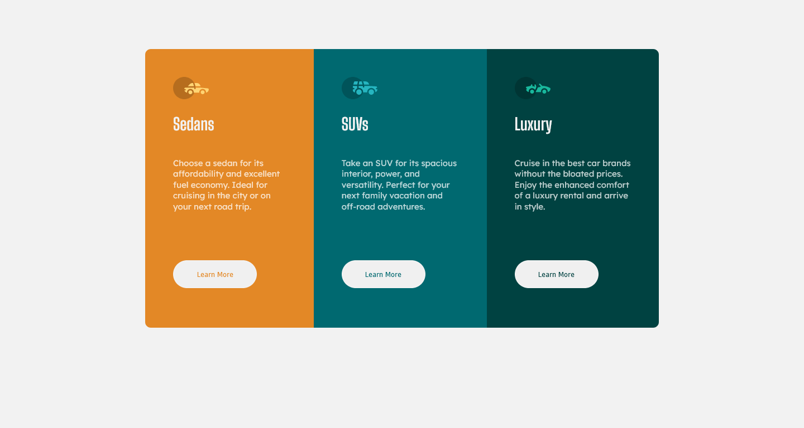
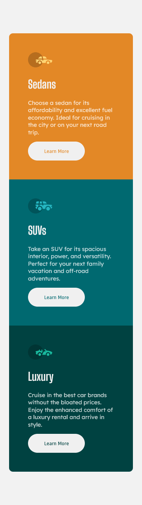

# Frontend Mentor - 3-column preview card component solution

This is a solution to the [3-column preview card component challenge on Frontend Mentor](https://www.frontendmentor.io/challenges/3column-preview-card-component-pH92eAR2-). Frontend Mentor challenges help you improve your coding skills by building realistic projects.

## Table of contents

- [Overview](#overview)
  - [The challenge](#the-challenge)
  - [Screenshot](#screenshot)
  - [Links](#links)
- [My process](#my-process)
  - [Built with](#built-with)
  - [What I learned](#what-i-learned)
  - [Continued development](#continued-development)
  - [Useful resources](#useful-resources)
- [Author](#author)
- [Acknowledgments](#acknowledgments)

**Note: Delete this note and update the table of contents based on what sections you keep.**

## Overview

### The challenge

Users should be able to:

- View the optimal layout depending on their device's screen size
- See hover states for interactive elements

### Screenshot

Desktop



Mobile



### Links

- Solution URL: [Add solution URL here](https://your-solution-url.com)

## My process

### Built with

- Semantic HTML5 markup
- Sass
- Flexbox
- Mobile-first workflow

### What I learned

This is my first time working with Sass, so it was a good practice. Also, i learned how to work with variables, how to use mixin for responsive design and how to work with multiple sass documents (e.g: \_globals, \_container, \_mixins and style).

```scss
//Responsive
@mixin desktop {
  @media only screen and (min-width: 1440px) {
    @content;
  }
}
```

```scss
.button {
  width: 9.375rem;
  height: 3.125rem;
  border: 2px solid $veryLightGray;
  border-radius: 25px;
  //Hover the button
  &:hover {
    background-color: inherit;
    color: $veryLightGray;
    cursor: pointer;
  }
  //Style each button
  &__sedan {
    color: $brightOrange;
  }
  &__suv {
    color: $darkCyan;
  }
  &__luxury {
    color: $veryDarkCyan;
  }
}
```

### Continued development

I will focus on how to be more organized and i will still practice sass.

### Useful resources

- [Resource 1](https://www.kodetop.com/web-responsive-utilizando-mixins-en-sass/) - This helped me on the responsive design.
- [Resource 2](https://stackoverflow.com/questions/10995294/border-radius-not-working) - This helped me when my border radius didn't work.
- [Resource 3](https://www.youtube.com/watch?v=HiXLkL42tMU) - This helped me to know how to work with GIT.
- [Resource 4](https://www.youtube.com/watch?v=8w_kHIAkucA) - This helped me to know how to work with Sass.

## Author

- Website - [Luis Silva](https://github.com/MalditoStive)
- Frontend Mentor - [@luis-silva-hub](https://www.frontendmentor.io/profile/luis-silva-hub)
